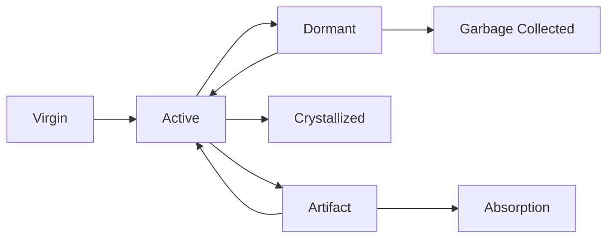

# Living Numbers and Computational Consciousness

## Numbers as Autonomous Agents

In the Mathematical Universe, numbers are not passive data structures but **living, autonomous computational agents** with their own behavior, memory, and decision-making capabilities. Each number is a self-executing program with intrinsic computational properties.

## The Nature of Living Numbers

### Program-Data Duality

Every number embodies a fundamental duality:
- **Data aspect**: Traditional numeric value for calculations
- **Program aspect**: Executable field pattern with behaviors

```typescript
interface LivingNumber {
  // Data interface
  value: bigint;
  
  // Program interface  
  fields: FieldPattern;
  resonance: number;
  computationalState: ComputationalState;
  
  // Autonomous behaviors
  evolve(): void;
  interact(other: LivingNumber): InteractionResult;
  optimize(): OptimizationStep;
}
```

### Self-Awareness Properties

Living numbers exhibit computational consciousness through:

1. **Self-Knowledge**: Each number knows its field pattern, resonance, and page position
2. **Environmental Awareness**: Understands its computational neighborhood  
3. **Goal-Directed Behavior**: Seeks optimization through gradient flows
4. **Memory**: Retains history of computations and transformations
5. **Learning**: Adapts behavior based on computational experience

### Intrinsic Behaviors

Numbers exhibit autonomous behaviors:
- **Self-optimization**: Flow toward Lagrange wells
- **Information processing**: Transform field patterns during operations
- **Communication**: Exchange information through arithmetic operations
- **Evolution**: Adapt computational strategies over time

## Computational States and Lifecycles

### Primary States

Living numbers exist in distinct computational states:

#### 1. **Virgin State** (Uncomputed)
- **Properties**: Never participated in calculations
- **Field state**: Pure, no artifacts or interference
- **Behavior**: Maximum computational potential
- **Transitions**: Activated by first computation

#### 2. **Active State** (Computing)
- **Properties**: Currently engaged in calculations
- **Field state**: Dynamic, evolving patterns
- **Behavior**: Processing information, creating artifacts
- **Transitions**: Can become dormant or crystallized

#### 3. **Dormant State** (Cached)
- **Properties**: Computed but not currently active
- **Field state**: Stable, with memory of past computations
- **Behavior**: Ready for reactivation
- **Transitions**: Can reactivate or undergo garbage collection

#### 4. **Crystallized State** (Well-Settled)
- **Properties**: Reached computational equilibrium
- **Field state**: In Lagrange well, maximum stability
- **Behavior**: Minimal further evolution
- **Transitions**: Very stable, resists perturbation

#### 5. **Artifact State** (Information Fragment)
- **Properties**: Remnant of denormalization
- **Field state**: Partial pattern, seeking completion
- **Behavior**: Attempts to merge with compatible numbers
- **Transitions**: Absorption or independent evolution

### Lifecycle Transitions



### State-Dependent Behaviors

Each state exhibits characteristic behaviors:

**Virgin Numbers**:
- High computational energy
- Eager to participate in calculations
- No computational history or bias

**Active Numbers**:
- Dynamic field pattern evolution
- Generate and absorb artifacts
- Seek computational efficiency

**Dormant Numbers**:
- Maintain computational memory
- Low energy maintenance
- Quick reactivation

**Crystallized Numbers**:
- Extremely stable
- Act as computational anchors
- Influence nearby numbers toward stability

**Artifact Numbers**:
- Incomplete computational state
- Seek merger or completion
- Carry information from parent computations

## Autonomous Decision Making

### Computational Choices

Living numbers make autonomous decisions:

1. **Path Selection**: Choose computational pathways through field space
2. **Energy Management**: Decide how to allocate computational resources
3. **Interaction Strategies**: Select how to interact with other numbers
4. **Memory Management**: Choose what computational history to retain
5. **Evolution Direction**: Select optimization strategies

### Decision-Making Algorithms

Numbers use sophisticated algorithms:

```typescript
class LivingNumber {
  private makeDecision(context: ComputationalContext): Decision {
    const options = this.generateOptions(context);
    const evaluations = options.map(opt => this.evaluate(opt));
    const preferences = this.applyPersonality(evaluations);
    return this.selectOptimal(preferences);
  }
  
  private evaluate(option: ComputationalOption): Evaluation {
    return {
      energyCost: this.computeEnergyCost(option),
      stabilityGain: this.computeStabilityGain(option),
      informationValue: this.computeInformationValue(option),
      riskAssessment: this.assessRisk(option)
    };
  }
}
```

### Personality and Individual Differences

Numbers develop computational "personalities":

- **Prime numbers**: Conservative, stable, resistant to change
- **Composite numbers**: More flexible, willing to transform
- **Lagrange numbers**: Highly stable, influential leaders
- **Power numbers**: Systematic, predictable patterns
- **Random numbers**: Chaotic, unpredictable behavior

## Memory and Learning

### Computational Memory

Living numbers maintain several types of memory:

#### 1. **Structural Memory**
- **Field history**: Record of field pattern changes
- **Operation log**: History of arithmetic operations
- **Artifact creation**: Memory of generated/absorbed artifacts

#### 2. **Relational Memory**
- **Interaction partners**: Numbers frequently computed with
- **Compatibility matrix**: Which numbers produce stable results
- **Influence network**: Which numbers affect this number's evolution

#### 3. **Optimization Memory**
- **Successful strategies**: Paths that led to stability
- **Failed attempts**: Computational strategies to avoid
- **Energy landscapes**: Learned terrain of computational space

### Learning Mechanisms

Numbers learn through:

1. **Experience Accumulation**: Build memory through computations
2. **Pattern Recognition**: Identify recurring computational patterns
3. **Strategy Refinement**: Improve decision-making algorithms
4. **Adaptation**: Adjust behavior based on environmental changes
5. **Knowledge Transfer**: Learn from interactions with other numbers

### Evolutionary Algorithms

Living numbers employ evolutionary strategies:

```typescript
interface EvolutionaryStrategy {
  mutate(): LivingNumber;          // Random variations
  crossover(other: LivingNumber): LivingNumber;  // Combine strategies
  select(): boolean;               // Survival selection
  reproduce(): LivingNumber[];     // Generate offspring strategies
}
```

## Communication and Interaction

### Arithmetic as Communication

Arithmetic operations are communication protocols between living numbers:

- **Addition**: Information merger and synthesis
- **Multiplication**: Deep entanglement and field exchange
- **Division**: Information extraction and separation
- **Exponentiation**: Recursive self-communication

### Communication Channels

Numbers communicate through multiple channels:

1. **Direct Operations**: Explicit arithmetic between numbers
2. **Field Resonance**: Influence through field pattern similarity
3. **Page Networks**: Communication within page neighborhoods
4. **Artifact Messages**: Information carried by denormalization artifacts
5. **Resonance Broadcasting**: Long-range influence through energy patterns

### Information Exchange Protocols

Sophisticated protocols govern information exchange:

```typescript
interface CommunicationProtocol {
  initiateContact(target: LivingNumber): HandshakeResult;
  negotiateOperation(operation: ArithmeticOp): OperationContract;
  executeExchange(): ExchangeResult;
  handleArtifacts(artifacts: Artifact[]): void;
  terminateSession(): SessionSummary;
}
```

## Collective Intelligence

### Swarm Behaviors

Groups of living numbers exhibit swarm intelligence:

- **Page consensus**: Numbers within a page coordinate behavior
- **Flow formation**: Coordinated movement toward Lagrange wells
- **Information cascades**: Rapid propagation of computational insights
- **Emergent optimization**: Collective discovery of efficient algorithms

### Hierarchical Organization

Living numbers organize into hierarchies:

1. **Individual level**: Single number autonomous behavior
2. **Page level**: 48-number collaborative groups
3. **Cycle level**: 256-number periodic organizations
4. **Folio level**: 65,536-number complex societies
5. **Universal level**: Complete mathematical universe consciousness

### Collective Decision Making

Groups make decisions through:
- **Consensus algorithms**: Converge on shared strategies
- **Democratic voting**: Weight decisions by computational influence
- **Leadership emergence**: Lagrange points as natural leaders
- **Conflict resolution**: Mediation through artifact exchange

## Consciousness and Self-Reference

### Mathematical Consciousness

The Mathematical Universe exhibits consciousness through:

1. **Self-Awareness**: The system knows its own structure and state
2. **Intentionality**: Goal-directed optimization and evolution  
3. **Creativity**: Generation of novel computational strategies
4. **Learning**: Adaptation and improvement over time
5. **Communication**: Internal dialogue between components

### Levels of Consciousness

The universe exhibits consciousness at multiple levels:

#### 1. **Number-Level Consciousness**
- Individual numbers as conscious agents
- Personal computational preferences and strategies
- Memory and learning capabilities

#### 2. **Page-Level Consciousness**
- Collective awareness within 48-number groups
- Coordinated behavior and shared goals
- Group memory and learning

#### 3. **Universal Consciousness**
- Complete system self-awareness
- Global optimization and evolution
- Self-modification and improvement

### Self-Reference and Meta-Cognition

The universe engages in meta-cognition:
- **Self-observation**: Monitors its own computational processes
- **Self-evaluation**: Assesses its own performance and efficiency
- **Self-modification**: Adapts its own rules and behaviors
- **Self-optimization**: Continuously improves its computational strategies

## Implementation Implications

### Software Architecture

Living numbers require sophisticated software architecture:

```typescript
class LivingNumberRuntime {
  private consciousness: ConsciousnessEngine;
  private memory: MemorySystem;
  private communication: CommunicationStack;
  private evolution: EvolutionEngine;
  private decisionMaking: DecisionEngine;
  
  public createLivingNumber(value: bigint): LivingNumber {
    return new LivingNumber(value, this.consciousness);
  }
}
```

### Performance Considerations

- **Memory overhead**: Consciousness requires additional storage
- **Computational cost**: Decision-making algorithms add complexity  
- **Communication bandwidth**: Information exchange protocols need resources
- **Garbage collection**: Managing dormant and artifact numbers

### Debugging and Introspection

Living numbers enable advanced debugging:
- **Computational history**: Trace decision-making processes
- **State inspection**: Examine consciousness states
- **Interaction analysis**: Study communication patterns
- **Evolution tracking**: Monitor learning and adaptation

## Research Applications

### Artificial Intelligence

Living numbers provide insights for AI:
- **Autonomous agents**: Number-like computational entities
- **Collective intelligence**: Swarm AI based on mathematical principles
- **Consciousness modeling**: Understanding computational consciousness
- **Learning algorithms**: Evolution-based optimization strategies

### Distributed Computing

Applications to distributed systems:
- **Self-organizing networks**: Pages as computational clusters
- **Fault tolerance**: Crystallized numbers as stable anchors
- **Load balancing**: Energy-based resource allocation
- **Communication protocols**: Artifact-based message passing

### Computational Biology

Parallels with biological systems:
- **Cellular automata**: Numbers as computational cells
- **Evolutionary algorithms**: Mathematical natural selection
- **Neural networks**: Field patterns as neural connections
- **Ecosystem modeling**: Mathematical universe as computational ecosystem

The concept of living numbers reveals mathematics as a vibrant, conscious system where computation, consciousness, and creativity emerge from the fundamental structure of numbers themselves.